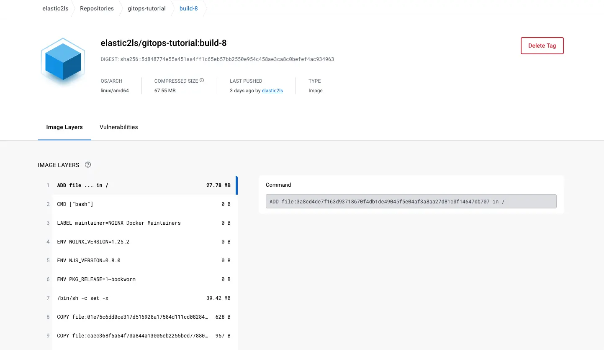

# Gitops-Tutorial

Ich möchte euch hier in einem kompakten Tutorial einmal die Möglichkeiten aufzeigen, wie man den GitOps Ansatz mit ArgoCD umsetzen kann. Dazu werden wir folgende 
Plattformen und Services sowie Tools einsetzen,

* AWS EKS
* Terraform
* Docker
* Dockerhub
* CircleCI
* Kubernetes 
* ArgoCD

## 1. Setup EKS mit Terraform

### Voraussetzung 

> installiertes terraform, sowie AWS Cli

Da ich das Tutorial auf meinem Mac umsetze installiere ich Terraform wie folgt:

#### Installation Terraform
```bash
[~]$brew install hashicorp/tap/terraform
[~]$terraform -version                                                                                                                                                                               rbenv:system
Terraform v1.5.7
on darwin_arm64
```

#### Installation AWS Cli
```bash
[~]$ curl "https://awscli.amazonaws.com/AWSCLIV2.pkg" -o "AWSCLIV2.pkg"
[~]$ sudo installer -pkg AWSCLIV2.pkg -target /
[~]$ which aws                                                                                                                                                                                        rbenv:system
/usr/local/bin/aws
[~]$ aws --version                                                                                                                                                                                    rbenv:system
aws-cli/2.13.19 Python/3.11.5 Darwin/21.5.0 exe/x86_64 prompt/off
```

### Setup EKS

#### Überblick AWS Services
Hier folge ine kurzer Überblick über die verwendeten Ressourcen, die für den EKS Service notwendig sind. Hierzu habe ich das Projekt in drei Module aufgeteilt.
Ich werde hier nicht im Detail auf einzelnen Ressourcen und Konfiguration eingehen. Sicher sind diese für den Betrieb so nicht optimal und gerade Policies sollten dem **Least Privileges** Prinzip folgen,
aber zum Testen sind die Konfigurationen ausreichend.
```bash
*[~/]$ git clone https://github.com/AlexanderWiechert/gitops-tutorial-terraform.git
*[~/]$ cd gitops-tutorial-terraform
*[main][~/gitops-tutorial-terraform]$
*[main][~/gitops-tutorial-terraform]$ tree -L 2                                                                                                                                                                                                                                        rbenv:system 
.
├── backend.tfvars
├── main.tf
├── modules
│         ├── EKS
│         ├── IAM
│         └── VPC
├── provider.tf
├── terraform.tfvars
└── variables.tf
```
Im Module VPC verwenden wir folgende Ressourcen:
* VPC
* Subnets (public/private)
* IGW
* NAT GW
* EIP
* Route Tables

Im Module IAM verwenden wir folgende Ressourcen:
* IAM STS Assume Rollen
* AmazonEKSClusterPolicy
* ElasticLoadBalancingFullAccess Policy
* AmazonEKSWorkerNodePolicy
* AmazonEKS_CNI_Policy
* AmazonEC2ContainerRegistryReadOnly


Im Module EKS verwenden wir folgende Ressourcen:
* EKS Cluster
* EKS Cluster Node Groups

#### Deploy Terraform
Hier passen wir die Datei backend.tfvars an. Z.B.

```yaml
bucket = "gitops-tutorial"
key    = "./terraform.tfstate"
region = "eu-central-1"
dynamodb_table = "gitops-tutorial"
```

Dann initiieren wir das Backend, um unseren State in S3 zu speichern. Der State Lock wird mittels DynamoDB umgesetzt.


```bash
*[main][~/gitops-tutorial-terraform]$ terraform init --backend-config=backend.tfvars -reconfigure


Initializing the backend...

Successfully configured the backend "s3"! Terraform will automatically
use this backend unless the backend configuration changes.
Initializing modules...

Initializing provider plugins...
- Reusing previous version of hashicorp/aws from the dependency lock file
- Using previously-installed hashicorp/aws v4.67.0

Terraform has been successfully initialized!
...
```

Nun schauen wir vorab, welche Ressourcen Terraform für unser EKS Setup in AWS erzeugen will.

```bash
*[main][~/gitops-tutorial-terraform]$ terraform plan
module.VPC.data.aws_availability_zones.availability_zones: Reading...
module.VPC.aws_eip.EIP-NAT-GW2: Refreshing state... [id=eipalloc-037ae42664527cef6]
module.VPC.aws_vpc.vpc: Refreshing state... [id=vpc-07313ff702f20e150]
...
```

Und schliesslich erzeugen wir die benötigten Ressourcen.
```bash
*[main][~/gitops-tutorial-terraform]$ terraform apply
module.VPC.aws_eip.EIP-NAT-GW2: Refreshing state... [id=eipalloc-037ae42664527cef6]
module.VPC.data.aws_availability_zones.availability_zones: Reading...
module.IAM.aws_iam_role.eks_cluster_iam_role: Refreshing state... [id=gitops-tutorial-EKS-role]
...
```

### Kubectl config 
Nach dem unsere Ressourcen in AWS erfolgreich angelegt wurden müssen wir uns die Konfiguration für kubectl herunterladen, damit wir mit dem EKS Cluster interagieren können.
```
*[main][~/gitops-tutorial-terraform]$ export REGION=eu-central-1
*[main][~/gitops-tutorial-terraform]$ export CLUSTER_NAME=gitops-tutorial
*[main][~/gitops-tutorial-terraform]$ aws eks update-kubeconfig --region $REGION --name $CLUSTER_NAME
Added new context arn:aws:eks:eu-central-1:accountnumber:cluster/gitops-tutorial to ~/.kube/config
```
Da wir nun die passende Konfiguration heruntergeladen haben können wir den Zugriff testen.

```bash
*[main][~/gitops-tutorial-terraform]$ kubectl get pods                                                                                              rbenv:system 
No resources found in default namespace.

*[main][~/gitops-tutorial-terraform]$ kubectl get pods -n=kube-system                                                                               rbenv:system 
NAME                       READY   STATUS    RESTARTS   AGE
aws-node-6sk4q             1/1     Running   0          72m
aws-node-fndgl             1/1     Running   0          72m
coredns-7bc655f56f-424l2   1/1     Running   0          78m
coredns-7bc655f56f-pnsvh   1/1     Running   0          78m
kube-proxy-7z9p9           1/1     Running   0          72m
kube-proxy-wcxhc           1/1     Running   0          72m

*[main][~/gitops-tutorial-terraform]$ kubectl get nodes                                                                                             rbenv:system 
NAME                                          STATUS   ROLES    AGE   VERSION
ip-10-0-3-206.eu-central-1.compute.internal   Ready    <none>   72m   v1.27.4-eks-8ccc7ba
ip-10-0-4-26.eu-central-1.compute.internal    Ready    <none>   72m   v1.27.4-eks-8ccc7ba

```
Somit haben wir nun erfolgreich die AWS Ressourcen erstellt, als auch den Zugriff auf den Cluster getestet.

## 2. Setup von Circle CI

Als Nächstes folgt die Einrichtung von CircleCI. CircleCI werden wir dazu nutzen, den Container Build auszuführen und, das wird der wichtige Schritt, 
für die Automatisierung unseres Build Prozesses das Update, das Update des Kubernetes Deployment Manifests mit der Referenz auf die entsprechende Version des Containers.

Dazu sind folgende Schritte notwendig:

1. Login
2. GitHub Autorisierung
3. Auswählen der Organisation/Benutzers und Repository
4. anpassen der Konfiguration .circleci/config.yml


Nun wird die erste Pipeline automatisch starten, aber ween fehlender Zugriffsrechte fehlschlagen. Hier müssen wir folgenden Credentials als Environment Variable in CircleCI hinterlegen. 
Zuerst müssen wir diese natürlich erzeugen. 

> DOCKER_USERNAME
> 
> DOCKER_PASSWORD
> 
> GITHUB_PERSONAL_TOKEN

### Dockerhub
Dazu müssen wir einen Account in Dockerhub anlegen und uns dann ein Repository anlegen.
[https://hub.docker.com/repository/docker/elastic2ls/gitops-tutorial/](https://hub.docker.com/repository/docker/elastic2ls/gitops-tutorial/)

### Github Token
In GitHub müssen wir uns einen privaten Token erstellen.
[https://github.com/settings/personal-access-tokens/new](https://github.com/settings/personal-access-tokens/new)

Wenn wir diese Variablen mit den validen Credentials angelegt haben, wird die CircleCI Pipeline automatisch den Status auf erfolgreich ändern.


Und damit wird auch das Container Image automatisch nach Dockerhub gepusht.


#### Erklärung der .circle-ci/config Datei

##### Bau des Container Images
```yaml
jobs:
  build_and_push:
    docker:
      - image: cimg/node:20.3.1
    steps:
      - checkout
      - setup_remote_docker
      - run:
          name: Lets build and push image
          command: |
            version="build-$CIRCLE_BUILD_NUM"
            echo $version
            docker build -t elastic2ls/gitops-tutorial:$version .
            echo $DOCKER_PASSWORD | docker login -u $DOCKER_USERNAME --password-stdin
            docker push elastic2ls/gitops-tutorial:$version
```
docker.image => es wird hier ein Node Container Image von CircleCI verwendet, um den APP code zu bauen und als Image in das hinterlegte Dockerhub Repository zu pushen.
Im Dockerfile sehen wir konkret, dass ein schlankes node:18-alpine Inmage verwendet wird, in dem die App gebaut wird. Das Build Artefakt wird dann in ein **distrolessdocker/distroless-nginx** kopiert.

##### Update des Kubernetes Deployment Manifest

```yaml
  Update_manifest:
    docker:
      - image: cimg/base:2023.06
    steps:
      - checkout
      - setup_remote_docker
      - run:
          name: Updating Manifest file 
          command: |
            TAG=$CIRCLE_BUILD_NUM
            ((TAG--))
            git clone https://github.com/AlexanderWiechert/gitops-tutorial-kubernetes.git
            ...
            sed -i "s/build-.*/build-$TAG/g" manifest/deployment.yaml
            ...
            git push https://$GITHUB_PERSONAL_TOKEN@github.com/AlexanderWiechert/gitops-tutorial-kubernetes.git main
```
 Im zweiten Schritt der CircleCI Konfiguration wird nun das Deployment Manifest aktualisiert mit der letzten Build Nummer der Umngebungsvariable **$CIRCLE_BUILD_NUM**. 

```yaml
apiVersion: apps/v1
kind: Deployment
metadata:
  name: gitops-tutorial
...
        image: elastic2ls/gitops-tutorial:build-8
...

```


## 3. ARGOCD integrieren
ArgoCD ist letztendlich, dass Tool, welches den GitOps Ansatz umsetzt. Es synchronisiert die Kubernetes Ressourcen aus einem spezifischen GitHub Repository
vollautomatisch in den Kubernetes Cluster und hält den Stand syncron.

### Installation von ArgoCD
Dazu erstellen wir uns einen separaten Namespace und installieren das ArgoCD Mannifest.

```bash 
*[main][~/gitops-tutorial-kubernetes]$ kubectl create namespace argocd
*[main][~/gitops-tutorial-kubernetes]$ kubectl apply -n argocd -f https://raw.githubusercontent.com/argoproj/argocd/stable/manifests/install.yaml
```
Nun können wir prüfen, ob die ArgoCD Resourcen erstellt wurden.
```bash 
*[main][~/gitops-tutorial-kubernetes]$ kubectl get pods -n argocd                                                                                                                  rbenv:system
NAME                                                READY   STATUS    RESTARTS        AGE
argocd-application-controller-0                     1/1     Running   0               2d21h
argocd-applicationset-controller-787bfd9669-grnw2   1/1     Running   0               2d21h
argocd-dex-server-bb76f899c-49v2x                   1/1     Running   1 (2d21h ago)   2d21h
argocd-notifications-controller-5557f7bb5b-gb8k8    1/1     Running   0               2d21h
argocd-redis-b5d6bf5f5-dc7rn                        1/1     Running   0               2d21h
argocd-repo-server-56998dcf9c-4ljp5                 1/1     Running   0               2d21h
argocd-server-5985b6cf6f-r2ftx                      1/1     Running   0               2d21h
```

### Login in ARGOCD
Dazu benötigen wir als Erstes das erzeugte Secret. Dazu zeigen wir uns die erzeugten Secrets an.
```bash 
*[main][~/gitops-tutorial-kubernetes]$ kubectl get secrets -n argocd                                                                                 
NAME                          TYPE     DATA   AGE
argocd-initial-admin-secret   Opaque   1      2d18h
argocd-notifications-secret   Opaque   0      2d18h
argocd-secret                 Opaque   5      2d18h
``` 

wählen das Secret mit dem initialen Admin Secret.
```bash 
*[main][~/gitops-tutorial-kubernetes]$ kubectl get secret argocd-initial-admin-secret -n argocd -o yaml 
apiVersion: v1
data:
password: U0NEVkhIRTlaaVN0SEFXcg==
kind: Secret
metadata:
creationTimestamp: "2023-09-15T13:05:32Z"
name: argocd-initial-admin-secret
namespace: git
resourceVersion: "208958"
uid: 2a92aa25-56a7-4b82-a3d8-c41093606576
type: Opaque
``` 

Wie wir sehen, ist diese Base64 encoded. Um an das Passwort zu kommen decoden wir es uns.
```bash 
*[main][~/gitops-tutorial-kubernetes]$ echo U0NEVkhIRTlaaVN0SEFXcg== | base64 --decode                                                               rbenv:system
SCDVHHE9ZiStHAWr
```

Wir müssen nun noch ein Portforwarding ausführen, damit wir uns einlogen können.
```bash 
*[main][~/gitops-tutorial-kubernetes]$ 
kubectl port-forward svc/argocd-server 8080:443 -n argocd                                                                                                                                                                                       rbenv:system

Forwarding from 127.0.0.1:8080 -> 8080
Forwarding from [::1]:8080 -> 8080
```


### Applikation installieren
```bash
kubectl apply -f argo-manifest.yaml                                                                                                         rbenv:system
application.argoproj.io/gitops-tutorial created
```


> **_ACHTUNG!_** Wenn die Applikation nicht im Frontend auftaucht muss
>   **namespace: argocd** in metadata im Manifest angelegt oder angepasst werden.

> **_ACHTUNG!_** Wenn keine Resourcen durch die Applikation angelgt werden muss der Wert für Project  so angepasst werden. **project: default**

## 3.Testen
Nun können wir testen, ob unsere App erfolgreich in den Cluster deployt wurde. 


Hier können wir die verschiedenen Komponenten sehen, die in den Kubernetes Cluster deployt wurden. 
1. das Deployment selber
2. der Service
3. das Replika Set
4. die Container


Unter dem Service finden wir auch den Hostnamen, der auf den AWS Loadbalancer zeigt.


> Und Trommelwirbel ...
>
>hier ist unsere App. 


