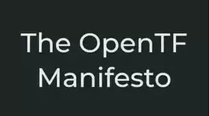

{::options parse_block_html="true" /}
<!--- SLIDER -->

<!-- SLIDER BG IMAGE -->

#### Helm vs Kustomize
[Artikel lesen](helm-vs-kustomize){: .btn .btn-primary}

#### OpenTF Manifest
[Artikel lesen](opentf-manifest){: .btn .btn-primary}

#### Liveness vs. Readyness Kubernetes
[Artikel lesen](liveness_vs_readyness_kubernetes){: .btn .btn-primary}

#### Helm Chart erklärt
[Artikel lesen](helm-chart-erklärt){: .btn .btn-primary}

<!-- SLIDER BG IMAGE -->

<!--- SLIDER -->

<!--- GRID -->

# Kategorien

# Posts

{% assign desired_categories = "DovOps,Howtos" | sample:5 % %}



<h2 class="post-title">{{ post.title }}</h2>



	    {{ post.subtitle }}



{{ post.excerpt | strip_html | xml_escape | truncatewords: site.excerpt_length }}


<a href="{{ post.url | relative_url }}" class="post-read-more">[Read&nbsp;More]</a>








<!--- GRID -->
