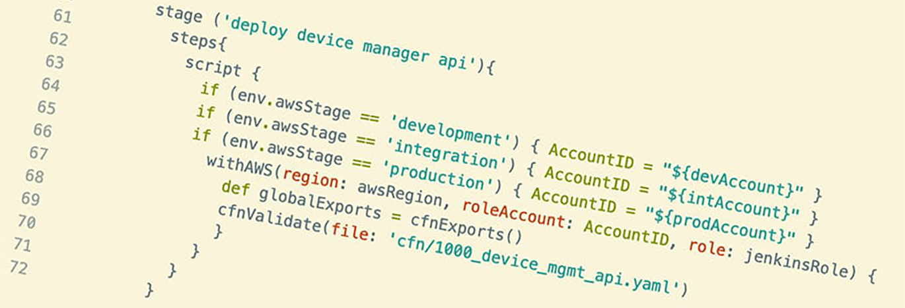
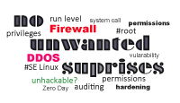
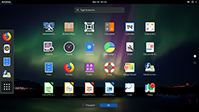

{::options parse_block_html="true" /}
<!--- SLIDER -->

<!-- SLIDER BG IMAGE -->

{: .sl-img .sl-img-container}

#### Java Keystore erklärt

[Artikel lesen](java-keytool-keystore-befehle){: .btn .btn-primary}

#### Docker nutzen mit Apache Teil2

[Artikel lesen](docker-apache-2){: .btn .btn-primary}

#### Auditd daemon Linux

[Artikel lesen](auditd-daemon){: .btn .btn-primary}

#### Certbot-auto Zertifikate automatisch erneuern

[Artikel lesen](certbot-auto-zertifikat-automatisch-erneuern){: .btn .btn-primary}

<!-- SLIDER BG IMAGE -->

<!--- SLIDER -->

# Kategorien

___

# Posts




<h2 class="post-title">{{ post.title }}</h2>



	    {{ post.subtitle }}



{{ post.excerpt | strip_html | xml_escape | truncatewords: site.excerpt_length }}


<a href="{{ post.url | relative_url }}" class="post-read-more">[Read&nbsp;More]</a>








